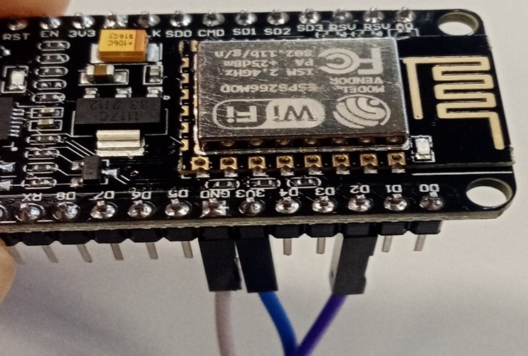
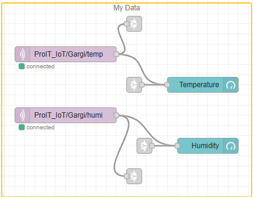
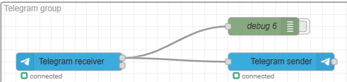
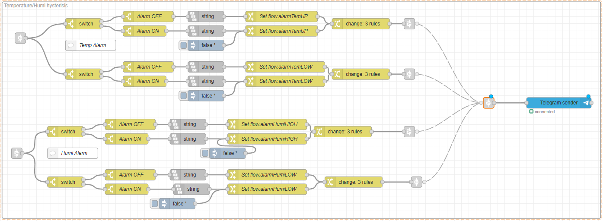
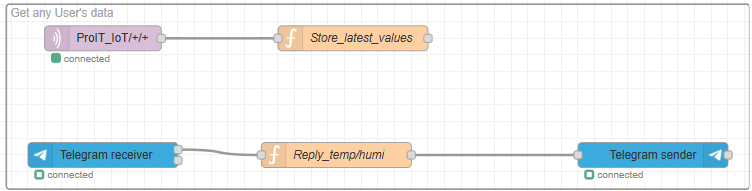
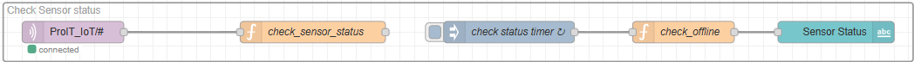

# ProIT_WS2526_IoT_Gargi


This project reads temperature and
humidity data from a DHT22 sensor,
publishes it using MQTT, processes it in
Node-RED, and sends the latest values to the user on
Telegram.
It also includes a Sensor status monitor to identify whether sensors are actively publishing data or have stopped sending updates

## Components
### Hardware

- Microcontroller ESP8266
- DHT22 Temperature & Humdity Sensor
- Raspberry Pi 3

### Software
- Node-Red
	+ Telegram Nodes
	+ String Node
	+ Dashboard Nodes
- Mosquitto Broker

### Repo Structure
```

├── Git_intro
│ ├── .gitkeep
│ ├── GitlabIntro.md
├── MQTT
│ └── Readme.md
├── Node-Red
│ ├── Alarm,MC.json
│ ├── Localhost.json
│ ├── Node_red_all_flows.json
│ └── Start_node_red.json
│ └── Telegram_flow.json
├── umqtt
│ ├── boot.py
│ └── simple.py
└── uPython
├── firstdhttest.py
└── upython.py
├── README.md
├── installMQTT_Broker_en.md.txt
```

## System Architecture

1. DHT22 reads temperature + humidity

2. Device publishes data to MQTT topics

3. Node-RED subscribes to MQTT topics

4. Create node-red flow to set threshold limit to trigger the alarm and send alert on telegram

5. User sends Telegram command to get the data of specific user →
Node-RED replies with latest readings to telegram bot

6. Dashboard shows if sensor is online or offline

## Micro controller

During the initial phase, the sensor logic and MQTT publishing were
validated using the Wokwi simulation environment.

After successful validation, the simulation was replaced with the
physical setup using ESP8266 + DHT22.

DHT22 reads temperature/humidity values. The DHT Sensor is connected to
pin 2.



### Following are few snippets of MicroPython code used to implement sensor data acquisition and MQTT publishing functionality.

MQTT Server Parameters-

MQTT_CLIENT_ID = \"Gargi_test\"

MQTT_BROKER = \"raspi3e14.f4.htw-berlin.de\"

MQTT_TOPIC = \"ProIT_IoT/Gargi\"

MQTT_TOPIC_TEMP = \"ProIT_IoT/Gargi/temp\"

MQTT_TOPIC_HUMI = \"ProIT_IoT/Gargi/humi\"

sensor = dht.DHT22(Pin(2))

#### Publishes them to MQTT topics every 10 seconds

client = MQTTClient(MQTT_CLIENT_ID, MQTT_BROKER)

client.connect()

client.publish(MQTT_TOPIC_TEMP, str(mytemp))

client.publish(MQTT_TOPIC_HUMI, str(myhumi))

time.sleep(10)

## Node-RED Flows

1. In Node-red started with subscribing to our own data published by sensor



2. Then introduced telegram bot and echoed the received messages



3. Using slider node created the message object to send messages to our bot.


4. Next implemented threshold limits that triggered the alarm when crossed the limit



5. Next part of implementation was to get temp/humi value of anyother user, used function node and subscribed to multiple users using wildcard topics



6. Finally, Sensor status monitoring was implemented to identify whether sensors are actively publishing data or have stopped sending updates


